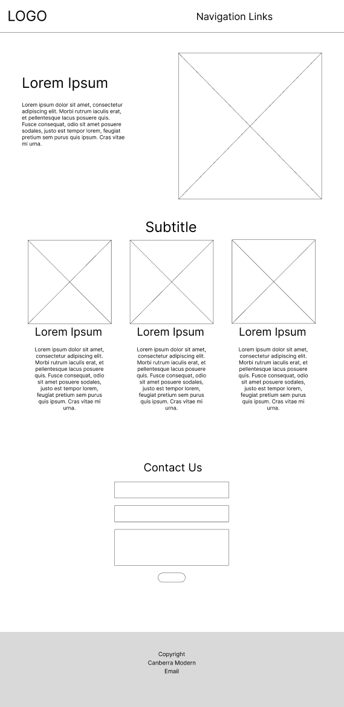
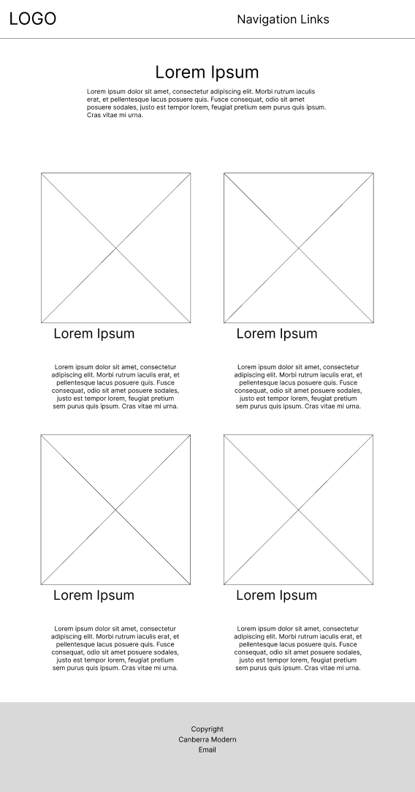
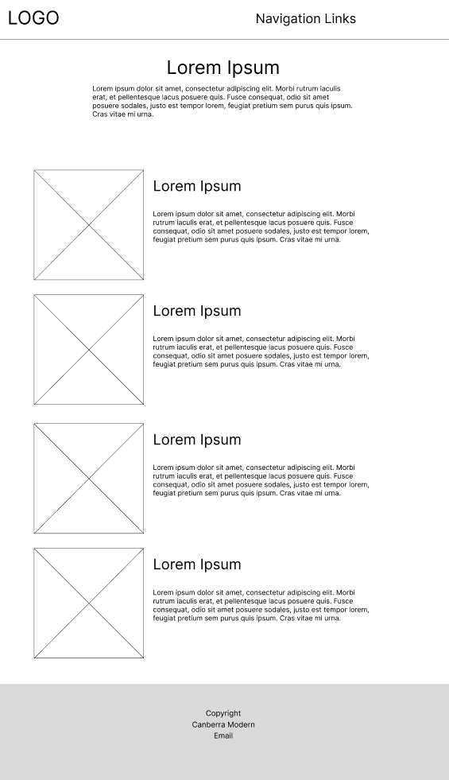
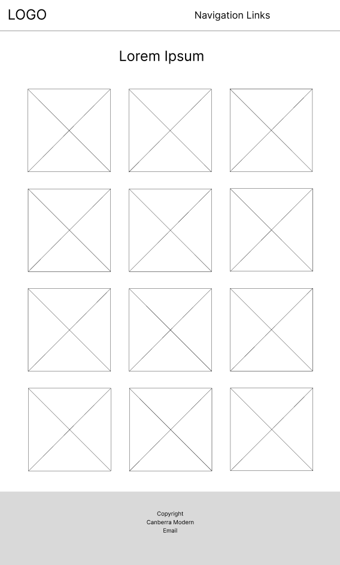
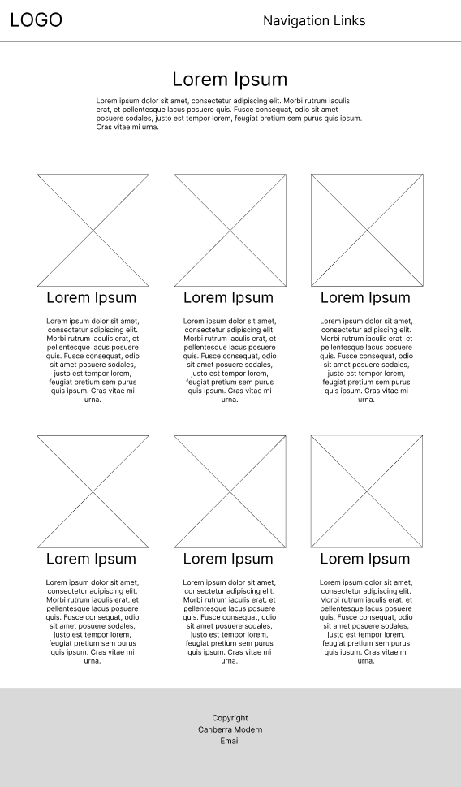

# Project 1 Mitchell Skelton u3236482 Front-End Web Design 11056

## Reflection
After the Canberra Modern visitors gave their brief about the website and what they expected I shorty began development on the website. I began buy creating all the html pages I needed and setting up all the appropriate tags and sections using semantic HTML tags where possible. My CSS code is organized into the groups and pages relevant to each other, making it easier to find and edit classes without getting lost or not knowing what I am editing. Mostly I think that my website turned out really nice. Having only little hiccups along the way which were solved with the help of some JavaScript I was able to create a seamless website design that used the main 2 colors from the CM logo. These colors were incorporated accordingly on buttons and hover affects to add some vibrance to the site. I used CSS grid to make my responsive header which turned out perfectly, the header accordingly adjusts to different sizes through media queries and once too small to show the links up top it transforms into a hamburger menu that has a seamless transition when clicked. My website is very responsive in all aspects around the website, I have tested the responsiveness all the way down to the tiny iPhone SE with it working close to perfectly. The main responsive part of the website was using CSS grids a lot, when the screen gets too small to handle a certain amount of grids I would take out a fractional unit reducing it by 1 until only 1 fractional unit is left at the smallest screen size. 

## Low-Fi Prototypes
I planned out all of my pages before development with Low-fidelity wireframes so I could have a visual representation to work off of. This greatly helped my development process as I was able to refer back to the wireframes over and over to complete my designs with improvisations along the way. My index page was kept pretty much the exact same apart from adding a call to action button below the first paragraph as well as the background behind the hero content. I added this background so that the top of the page had a seamless flow into the content below. The title below acts as a hook for the user to scroll down and read the rest of the page. This leads them to the about section which has been combined with the index page as it is unnecessary to have a separate page for this section. I kept the events page the exact same apart from adding buttons below each paragraph so the user can book the event. The partners page was also pretty straight forward and didn’t need to be adjusted from the wireframe. The gallery page had a slight modification as instead of having 3 rows I added a 4th as on larger screens such as my 2k monitor a 4th row could be easily implemented. These rows adjust accordingly to peoples screen sizes. Lastly the Canberra’s Modern (CM) page had a slightly different layout than the rest of the pages. So far all of my pages had been aligned with the image on the top and so I wanted to add some variety by adding the image to the side instead. The wireframe is implemented in the final website exactly as planned except when scaling down to smaller screens the images end up being on the top instead of to the side for readability purposes.
### Index Page

### Events Page

### Canberra's Modern Page

### Gallery Page

### Partners Page
